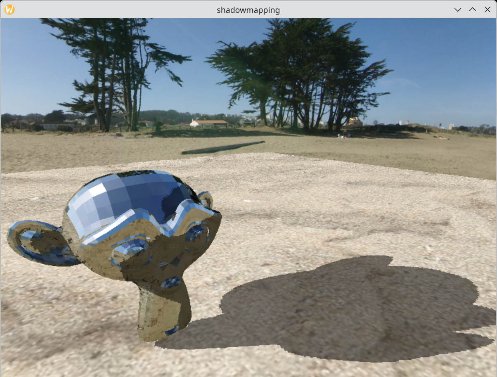

# Task 06 - Shadowmapping, Teil 1



Diese Aufgabe baut auf Task 05 auf, nutzen Sie also ihr bestehendes Programm
aus der vorhergegangenen Aufgabe.

## Idee

Die Idee beim Shadowmapping ist es, die Szene aus Sicht der Lichtquelle zu rendern
und das Resultat in einer Textur zu speichern. Diese Textur wird *Shadowmap* genannt.
Danach wird die Szene aus Sicht der Kamera, wie bisher, gerendert. Allerdings wird
zusätzlich die Shadowmap gebunden und genutzt, um zu prüfen, ob das Fragment im
Schatten liegt oder nicht. Konkret wird der Abstand des gegebenen Fragments zur Lichtquelle
geprüft. Ist dieser Abstand grösser als der Abstand zu einem *Blocker*, also ein Objekt welches
die Sicht zur Lichtquelle blockiert, so befindet sich das Fragment im Schatten.

## Rendern in eine Textur
Um in eine Textur zu rendern wird ein *Framebuffer* benötigt. Bisher haben wir
den *default framebuffer* genutzt, der automatisch von OpenGL zur verfügung
gestellt wird. Der Framebuffer kann wie ein Kanvas angesehen werden, auf dem
die finalen Pixel landen.
Einen Framebuffer erstellt man folgendermassen:
```cpp
GLuint FBO;
glCreateFramebuffers(1, &FBO);
```

An einen Framebuffer werden mehrere *Attachments* gehängt. Zum Beispiel
ein *depth attachment* und ein *color attachment*. Diese Attachments
werden in Form von Texturen erstellt. Erstellen Sie eine Textur, um
diese als *depth attachment* dem erstellen Framebuffer zuzuweisen.
Die Zuweisung erfolgt durch:
```cpp
glNamedFramebufferTexture(FBO, GL_DEPTH_ATTACHMENT, texture, 0); /* 0 = mipmap level */
```
Da wir ausschliesslich am Abstand von der Lichtquelle zu den Objekten (siehe oben)
interessiert sind, nutzen wir lediglich ein *depth attachment*. Bereiten
Sie die Texture `texture` entsprechend vor.

Um nun in diese Textur zu rendern, binden Sie den Framebuffer vor
den Draw-calls:
```cpp
shadowMapShader.Use();
glViewport(0, 0, SHADOW_MAP_SIZE, SHADOW_MAP_SIZE);
glNamedFramebufferDrawBuffer(FBO, GL_NONE);
glBindFramebuffer(GL_FRAMEBUFFER, FBO);
```
Der Call von `glViewport` ist notwendig, sodass die Viewport-Transformation
korret für die gewählte Shadowmap-Size `SHADOW_MAP_SIZE` (definieren Sie
selbst) korrekt ist.

Nachdem Sie in die shadowmap gerendert haben, wechseln Sie zurück auf
den default Framebuffer und passen Sie die Viewport-Size an die Fenstergroesse an.
Das zurückwechseln auf den default Framebuffer erfolgt durch:
```cpp
glBindFramebuffer(GL_FRAMEBUFFER, 0);
```

## Reprästentation der Lichtquelle

Nutzen Sie eine weitere Kamera, um die Position und Orientierung der Lichtquelle zu
bestimmen. Rendern Sie eine Kugel und färben diese in einer gut Sichtbaren Farbe
ein, um die Lichtquelle in der Szene zu visualisieren.

## Samplen der Shadowmap

Um von der Shadowmap Textur zu samplen, binden Sie diese wie andere Texturen
auch. Um einen ordentlichen Schattenwurf zu visualisieren, laden Sie ein
weiteres Modell einer Plane, die sich in der ZX-Plane befindet und damit
den Boden repräsentiert. Sie können die Vertices (und ggf. Indices) natürlich auch auch selbst
im Code deklarieren und müssen nicht extra ein OBJ File laden.
Der Boden soll nicht über Environment Mapping (siehe Task 05) texturiert werden
sondern eine eigene Textur erhalten. Laden Sie dazu ein geeignetes Bild.

## Ein-/Ausschalten der Shadowmap

- Fügen Sie via *ImGUI* eine *ImGui::Checkbox* hinzu, die es Ihnen erlaubt, den
  Schatten zu aktivieren bzw. zu deaktivieren.
- Fügen Sie eine weiter *ImGui::Checkbox* hinzu, welche die Texturierung des Bodens
  an/ausschaltet. Bei ausgeschalteter Textur soll der Boden in weiss gerendert werden,
  sodass der Schatten gut sichtbar ist.
- Fügen Sie ein *ImGui::DragFloat3*-Element hinzu, der es Ihnen ermöglicht, die Lichtquelle
  entlang der Weltkoordinaten Achsen zu verschieben.

## Hinweise

- Um den Algorithmus von Shadowmapping zu verstehen, nutzen Sie zum Beispiel
  das Buch *Computergrafik, Band 1* von Nischwitz et. al. Dieses ist 
  in der Bibliothek verfügbar! Bedienen Sie sich gerne auch alternativer
  Quellen ;) Sie müssen jedoch in der Lage sein Ihren Code zu erklären.

- Sie werden auf einige Renderingartefakte beim Schattenwurf stossen. Dokumentieren Sie, wie
  man diese nennt, wie sie entstehen und wie diesen entgegengewirkt werden kann.


